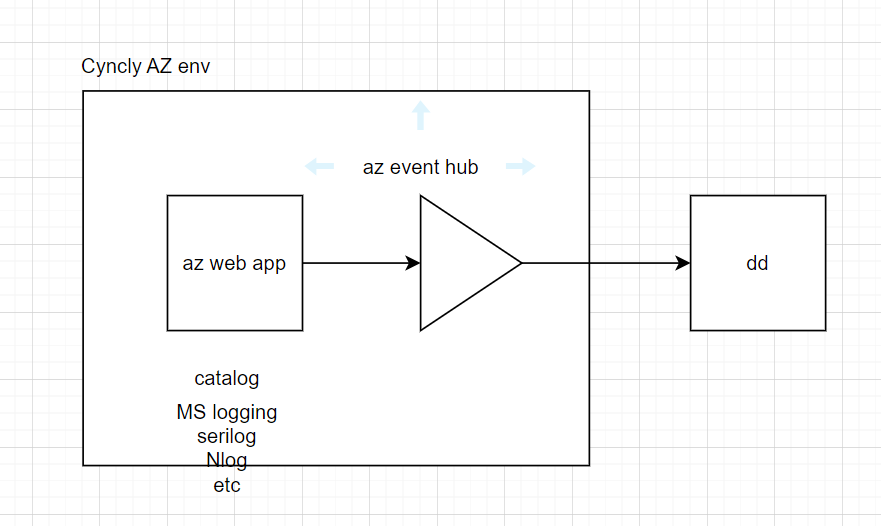

## Evaluation 

### Notes

1. Azure Event hub usage and cost needs to be tracked 
1. Disable Application insights and hence no new entries in AZ Log analytics 
1. Any services or reporting build on top of Log analytics will be broken 
1. Duplicate Persistant of logs is not a valid concerns 

### Azure integration for enabling APM

